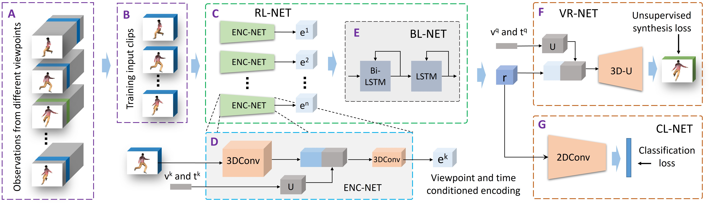
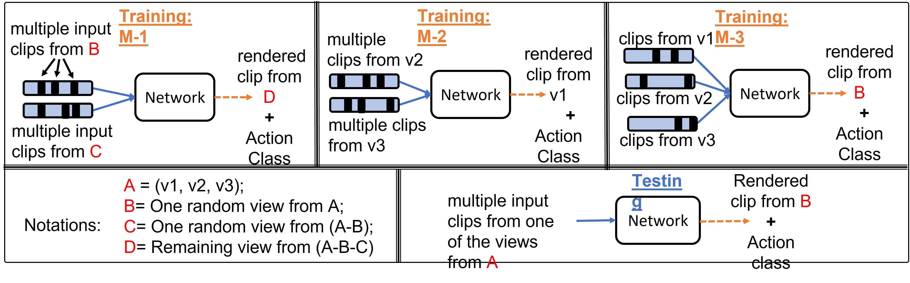

# Multi-view Action Recognition using Cross-view Video Prediction, ECCV 2020

Trained models available on request.

## Overview

An overview of the proposed representation learning framework. An action is captured from different viewpoints (v1, v2, v3, ..., vn) providing observations (o1, o2, o3, ..., on). Video clips from two viewpoints (v1 and v2) at arbitrary times (t1 and t2) are used to learn a representation (r) for this action, employing the proposed representation learning network (RL-NET). The learned representation (r) is then used to render a video from an arbitrary query viewpoint (v3) and time (t3) using proposed video rendering network (VR-NET). The representation thus learned is used for action recognition using classification network (CL-NET)

## Outline of the framework

Outline of the proposed unsupervised cross-view video rendering framework. A: A collection of observations (o) for a given action from different viewpoints. B: Training clips from the set of observations captured from different viewpoints and at different times. C: Representation learning network (RL-NET), which takes video clips from different viewpoint and time as input and learns a representation r. D: ENC-NET is used to learn individual video encodings ek conditioned on its viewpoint vk and time tk. E: The blending network (BL-NET) combines encodings learned from different video clips into a unified representation r. F: The representation r is used to predict a video from query viewpoint vq and time tq using VR-NET. G: The representation r can also be used for action classification using CL-NET. 3D-U refers to 3D convolutions combined with upsampling and U refers to upsampling.

## Training Strategies

Details of different training strategies (M-1, M-2, and M-3) which are used to study the effect of video rendering on representation learning for action classification. All the three variations use the same testing strategy
